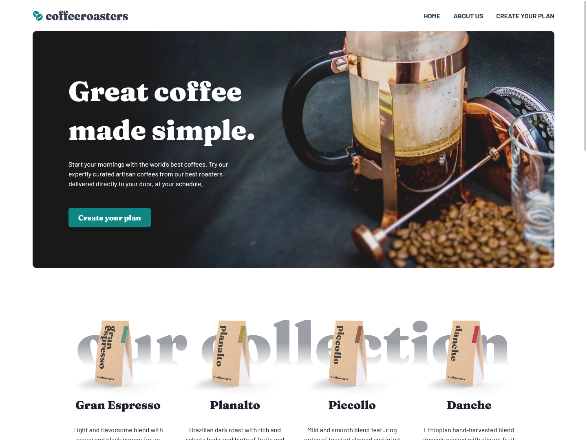

# Frontend Mentor - Coffeeroasters subscription site solution

This project comes from the [Coffeeroasters subscription site challenge on Frontend Mentor](https://www.frontendmentor.io/challenges/coffeeroasters-subscription-site-5Fc26HVY6). It has been altered to provide improved interpretation of vertical rhythm and typescales principles in the design.

## Table of contents

- [Frontend Mentor - Coffeeroasters subscription site solution](#frontend-mentor---coffeeroasters-subscription-site-solution)
  - [Table of contents](#table-of-contents)
  - [Overview](#overview)
    - [Screenshot](#screenshot)
  - [My process](#my-process)
    - [Built with](#built-with)
    - [What I learned](#what-i-learned)
    - [Continued development](#continued-development)
  - [Author](#author)

## Overview

This is a design-to-code project to showcase products in a subscription-based e-commerce site. The featured functionality is a form containing your options when setting up the subscription, up until the point of starting a "checkout" process. For the the purposes of this project, the checkout will simply reset the options. Persistant state on refresh with Local Storage is provided.

Users should be able to:

- View the optimal layout for each page depending on their device's screen size
- See hover states for all interactive elements throughout the site
- Make selections to create a coffee subscription and see an order summary modal of their choices
  - Once the user selects the "Checkout" button on the modal, a confirmation toast appears, and the selections reset to the default values.

### Screenshot



Live Site URL: [https://coffeeroastersub.gatsbyjs.io](https://coffeeroastersub.gatsbyjs.io)

## My process

### Built with

- [Chakra UI](https://www.chakra-ui.com) Components with Style Props
- [Gatsby](https://gatsbyjs.com) - React framework with static querying powered by GraphQL
- Mobile-first workflow
- TypeScript
- Jest Testing

### What I learned

This project comes with many firsts in using Chakra UI, Gatsby's Static Querying with GraphQL, TypeScript, and Jest.

The static query feature made it easy to import assets, and use JSON files to hold iterated content like the collection options, steps to the subscription process, the options in the form, etc. This was great practice in working with GraphQL.

Chakra UI was chosen to experience using a component library that is accessible-first, and provided similar features compared to TailwindCSS in setting up styling to the site, complete with a theme config file to customize. As a lot of it's components and tools are not completely provided in the website documentation, it provided me a great opportunity to dive into the npm package to discover what it had to offer, finding valuable custom react hooks and better understanding of how to use the components and work with TypeScript.

With the help of the Chakra UI and react packages with their typing, I was able to better understand the use of TypeScript.

The main thing I learned with TypeScript is it's use with Chakra in custom components, where I needed to provide values dynamically to Chakra props from a boolean function prop passed to the custom component. Since at the base, TypeScript will throw an error if a value passed to a Chakra Prop can become `false` this means that sometimes you have to provide explicit typing to a boolean prop to show that it will never be `false`. In the cases provided to the `SubscriptionDetails` component, where if it is being rendered in the subscription page, then the component will have a different background color and added padding at certain breakpoints, I use a short circuit operation with the logical AND in the the respective Chakra props. The operation begins with the boolean prop, which will be either `true` or `undefined` which TypeScript will accept in this context. If true, then the value on the right side will be compiled. Otherwise, `undefined` will be returned and will not compile the prop, or not compile the breakpoint if an object is used.

```javascript
<Stack paddingY={onSubscribePage && '88px'}>
```

You use an object in a Chakra prop if you were defining values at different brekapoints. If I were to provide a check for one or more breakpoints, you can also use a spread operation by putting the short circuit operation in parentheses, and the right side can still be an object which if returned will spread into the main object.

```javascript
<Stack paddingX={{ ...(onSubscribePage && { base: '24px', md: '42px' }), xl: '88px' }}>
```

Jest is still a work-in-process with understanding. This project provided the ability to understand fundamental techniques in testing current rendering of components, and testing click actions with states such as with the `Layout` component. Further learning and use of Jest is planned for future project with complex functionality.

### Continued development

This project is the bases for continued use and learning of TypeScript in React projects.

I also highly favor the use of Chakra UI over Tailwind because of the Accessibility focus and hope to also be able to contribute to the documentation to help make more of the components available to the community in understanding their use.

Jest will be a standard addition for future projects.

## Author

- Website - [Tyler Pfledderer](https://tylerpweb.dev)
